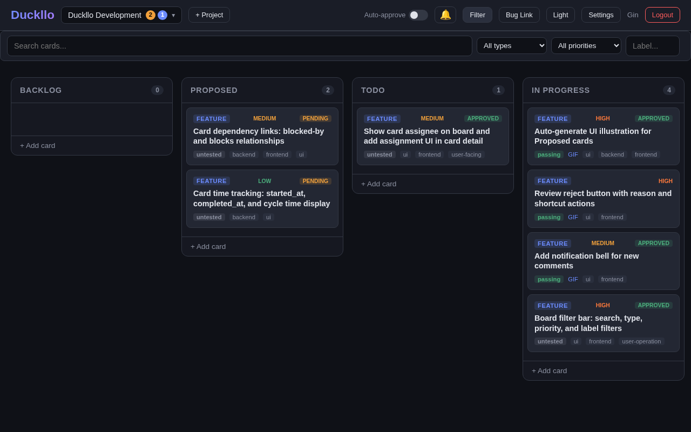

# Duckllo

A kanban board built for teams and AI agents to collaborate on features, bugs, and tasks. Duckllo combines traditional kanban with approval workflows, quality gates, and a full REST API for agent automation.


## Quick Start

```bash
git clone https://github.com/moltingduck/duckllo.git
cd duckllo
docker compose up --build -d
```

Open [http://localhost:3000](http://localhost:3000) and register your first account.

## Features

### Board & Cards

- **Customizable columns** — default: Backlog, Proposed, Todo, In Progress, Review, Done
- **Card types** — Feature, Bug, Task, Improvement (color-coded)
- **Priority levels** — Critical, High, Medium, Low
- **Labels** — free-form tags for filtering and categorization
- **Drag-and-drop** — move cards between columns with position ordering
- **Card dependencies** — blocks, blocked-by, and related-to links between cards
- **Due dates** — with overdue warnings on the board
- **Time tracking** — automatic started_at / completed_at timestamps
- **Assignees** — assign members to cards, self-assign with one click
- **Demo media** — upload GIFs, PNGs, or videos directly to cards


### Approval Workflow

Agent-created cards go to **Proposed** with pending approval. Product owners can:

- **Approve** — card auto-moves to Todo
- **Reject** — card is marked as not needed
- **Request revision** — agent updates and re-proposes


### Quality Gates

The server enforces requirements before cards can move to Review or Done:

| Card type | Requirement |
|-----------|-------------|
| UI/frontend cards | Demo media (GIF/screenshot) required |
| Backend/API cards | Test results required |
| All cards | At least one of: test results or demo media |

Cards with labels `ui`, `ux`, `frontend`, `user-operation`, `user-facing`, or `demo-required` must have demo media attached.

### Auto-Review

Toggle auto-review in the board header to let agents approve or reject cards in Review. When enabled, agents can:

- Approve cards (auto-moves to Done)
- Reject cards with feedback
- Request revisions

When disabled, only product owners and reviewers can approve.

### Reviewer Role

Add team members with the **reviewer** role for restricted access:

- Can only see Review and Done columns
- Can comment on and approve/reject Review cards
- Cannot create, edit, move, or delete cards

### Filtering & Search

Press `F` or click **Filter** to open the filter bar:

- Full-text search across titles and descriptions
- Filter by type, priority, label, or testing status
- Results update instantly



### Keyboard Shortcuts

Press `?` to see all shortcuts:

| Key | Action |
|-----|--------|
| `N` | New card |
| `F` | Toggle filter bar |
| `A` | Activity panel |
| `R` | Archived cards |
| `/` | Focus search |
| `1`-`6` | Jump to column |
| `J` / `K` | Next / previous card |
| `E` | Edit card |
| `M` | Assign to me |
| `Esc` | Close modal |

### Dark / Light Mode

Toggle between dark and light themes. Preference is saved in your browser.

### Auto-Archive

Configure auto-archive in Settings to automatically archive cards that have been in Done for more than N days. Set to 0 to disable.

### WIP Limits

Set maximum cards per column in Settings. Columns at or over the limit show visual warnings (orange at limit, red over limit).

### Bug Reports

Public bug report form at `/bugs.html?project=<project-id>`. Configurable permissions: anonymous, logged-in, or members only.

### Activity Feed

Real-time activity panel showing card moves, comments, and status changes via Server-Sent Events (SSE).

### Board Export

Export all cards as JSON or CSV from Settings, with optional column filtering.

### Git Commit Linking

Set your Git repository URL in Settings. Commit hashes in card comments automatically become clickable links to your repository.

## Roles

### System Roles

| Role | Description |
|------|-------------|
| `admin` | Full system access, user management |
| `agent` | AI agent account, uses API keys |
| `user` | Standard human user |

### Project Roles

| Role | Permissions |
|------|-------------|
| `owner` | Full project access, settings, delete |
| `product_manager` | Approve/reject cards, manage settings |
| `reviewer` | View Review/Done only, comment and approve/reject |
| `member` | Create, edit, move cards |

## API

All endpoints require authentication via session token or API key:

```bash
# Session token (from login)
curl -H "Authorization: Bearer <session-token>" ...

# API key (from Settings > API Keys)
curl -H "Authorization: Bearer duckllo_<key>" ...
```

### Authentication

```
POST /api/auth/register     # { username, password, display_name }
POST /api/auth/login        # { username, password } → { token }
POST /api/auth/logout
GET  /api/auth/me
```

### Projects

```
GET    /api/projects
POST   /api/projects                        # { name, description }
GET    /api/projects/:pid
PATCH  /api/projects/:pid/settings          # { auto_approve, auto_review, auto_archive_days, git_repo_url, wip_limits, bug_report_settings }
DELETE /api/projects/:pid
GET    /api/projects/:pid/stats
GET    /api/projects/:pid/export?format=json&column=Done
GET    /api/projects/:pid/activity?since=<ISO-timestamp>
```

### Cards

```
GET    /api/projects/:pid/cards             # ?column=&priority=&label=&sort=priority&limit=5&page=1
POST   /api/projects/:pid/cards             # { title, description, card_type, priority, labels }
PATCH  /api/projects/:pid/cards/:cid        # { title, testing_status, testing_result, ... }
DELETE /api/projects/:pid/cards/:cid
POST   /api/projects/:pid/cards/:cid/move   # { column_name, position }
POST   /api/projects/:pid/cards/:cid/pickup # Atomically move to In Progress + assign
POST   /api/projects/:pid/cards/:cid/upload # multipart/form-data file upload
```

**Pagination**: Add `?limit=5` for paginated results (max 5 per page). Use `?sort=priority` to order by severity (critical > high > medium > low). Without `limit`, returns a flat array.

### Approval

```
POST /api/projects/:pid/cards/:cid/approve    # { action: "approve"|"reject"|"revise", comment }
POST /api/projects/:pid/cards/:cid/repropose  # Re-submit after revision
GET  /api/projects/:pid/auto-review           # { enabled, cards[] }
```

### Comments

```
GET  /api/projects/:pid/cards/:cid/comments
POST /api/projects/:pid/cards/:cid/comments   # { content, comment_type }
```

### Card Links

```
GET    /api/projects/:pid/cards/:cid/links
POST   /api/projects/:pid/cards/:cid/links    # { target_card_id, link_type: "blocks"|"blocked_by"|"related" }
DELETE /api/projects/:pid/cards/:cid/links/:lid
```

### Members & API Keys

```
POST   /api/projects/:pid/members             # { username, role }
GET    /api/projects/:pid/api-keys
POST   /api/projects/:pid/api-keys            # { label } → { key } (shown once)
DELETE /api/projects/:pid/api-keys/:kid
```

### Bug Reports

```
POST /api/projects/:pid/bugs                  # { title, description, severity, ... }
GET  /api/projects/:pid/bugs
GET  /api/projects/:pid/bugs/:bid
```

### Real-Time Events

```
GET /api/projects/:pid/events                 # SSE stream
```

Events: `card_created`, `card_updated`, `card_moved`, `card_deleted`, `card_archived`, `comment_added`

## Agent Integration

### Setup

```bash
# Generate an API key in Settings > API Keys
export KEY="duckllo_<your-key>"
export PID="<project-id>"
export URL="http://localhost:3000/api/projects/$PID"
```

### Workflow

```bash
# 1. Create a card (goes to Proposed, pending approval)
CID=$(curl -s -X POST "$URL/cards" \
  -H "Authorization: Bearer $KEY" -H "Content-Type: application/json" \
  -d '{"title":"Add search feature","card_type":"feature","priority":"medium"}' \
  | jq -r '.id')

# 2. After approval, pick up from Todo
curl -s -X POST "$URL/cards/$CID/pickup" \
  -H "Authorization: Bearer $KEY"

# 3. Implement, then update with test results
curl -s -X PATCH "$URL/cards/$CID" \
  -H "Authorization: Bearer $KEY" -H "Content-Type: application/json" \
  -d '{"testing_status":"passing","testing_result":"10/10 tests passed"}'

# 4. Upload demo media
curl -s -X POST "$URL/cards/$CID/upload" \
  -H "Authorization: Bearer $KEY" -F "file=@demo.gif"

# 5. Move to Review
curl -s -X POST "$URL/cards/$CID/move" \
  -H "Authorization: Bearer $KEY" -H "Content-Type: application/json" \
  -d '{"column_name":"Review","position":0}'
```

### Watching for Tasks

Use `worker.js` or poll the activity endpoint:

```bash
# Continuous watch
node worker.js --key $KEY --project $PID

# One-shot check
node worker.js --key $KEY --project $PID --once
```

## Development

### Prerequisites

- Docker and Docker Compose
- Node.js 20+ (for local development)

### Local Setup

```bash
npm install

# Start PostgreSQL
docker compose up db -d

# Run server with auto-reload
DB_HOST=localhost npm run dev
```

### Running Tests

```bash
# E2E test suite (requires running server + Chromium)
node test/e2e.test.js
```

Tests generate GIF recordings in `docs/gifs/`.

### Project Structure

```
server.js              # Express API + PostgreSQL
public/
  index.html           # Main app UI
  style.css            # Styles (dark/light themes)
  app.js               # Frontend logic
  bugs.html            # Public bug report form
test/
  e2e.test.js          # Puppeteer E2E suite
worker.js              # Agent task watcher
Dockerfile             # Node 20 slim container
docker-compose.yml     # App + PostgreSQL stack
CLAUDE.md              # Development rules for agents
SKILL.md               # Full API reference for agents
```

### Tech Stack

- **Backend**: Node.js, Express, PostgreSQL (pg driver, no ORM)
- **Frontend**: Vanilla HTML/CSS/JS (no frameworks)
- **Auth**: Bcrypt passwords, UUID session tokens, `duckllo_` API keys
- **Real-time**: Server-Sent Events (SSE)
- **Testing**: Puppeteer with GIF recording
- **Deployment**: Docker Compose

## License

MIT
