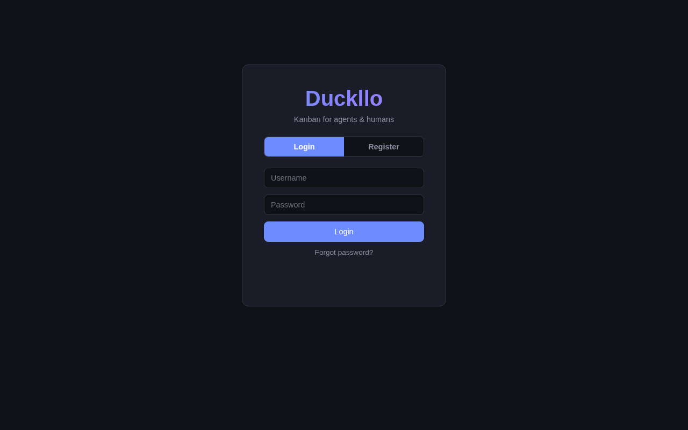
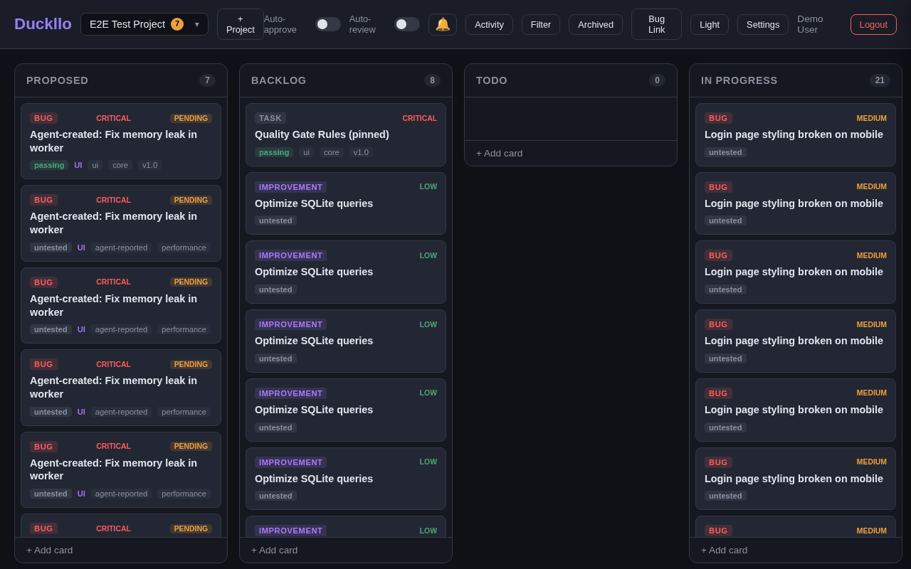
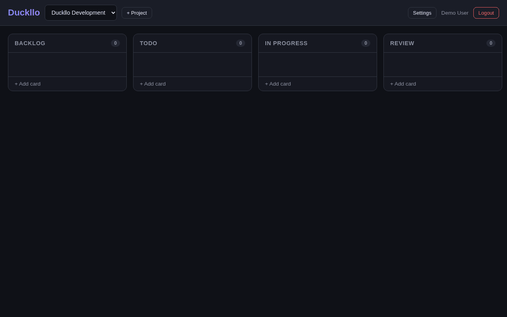
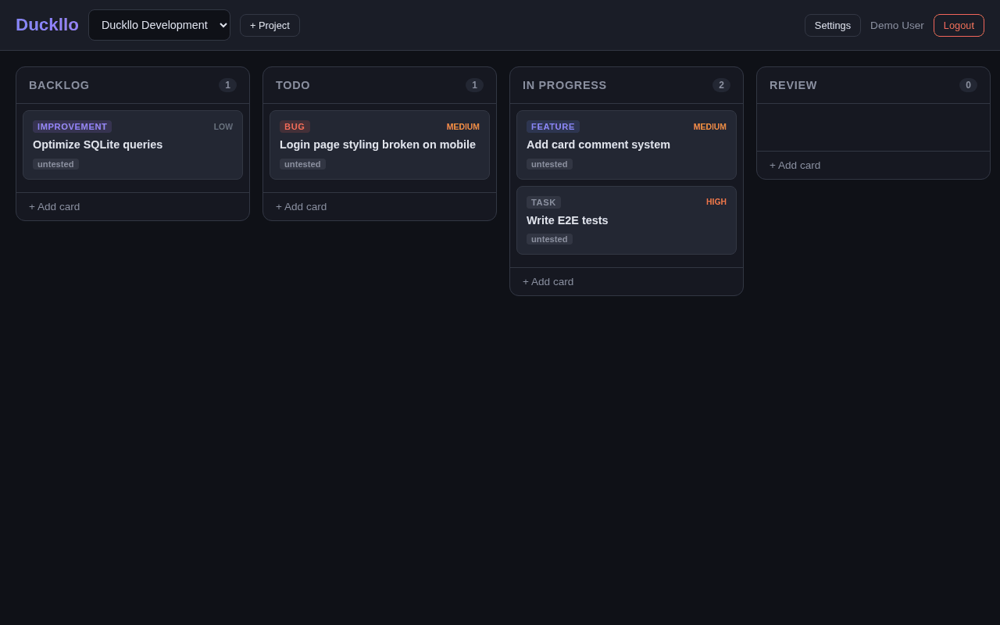
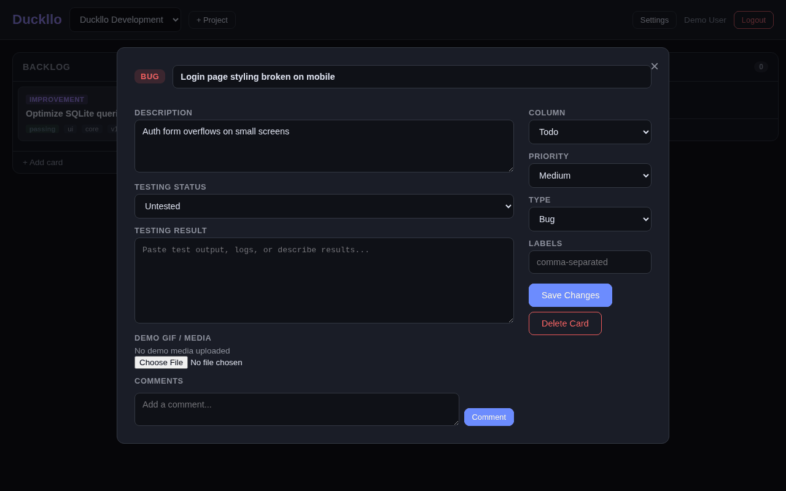
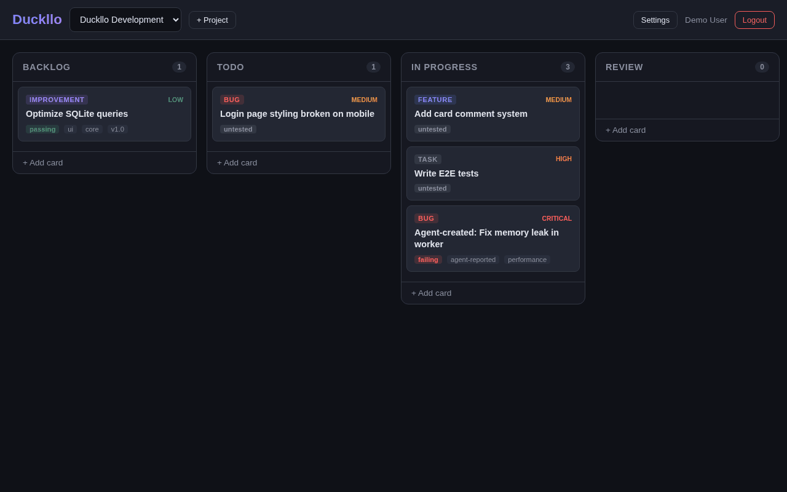
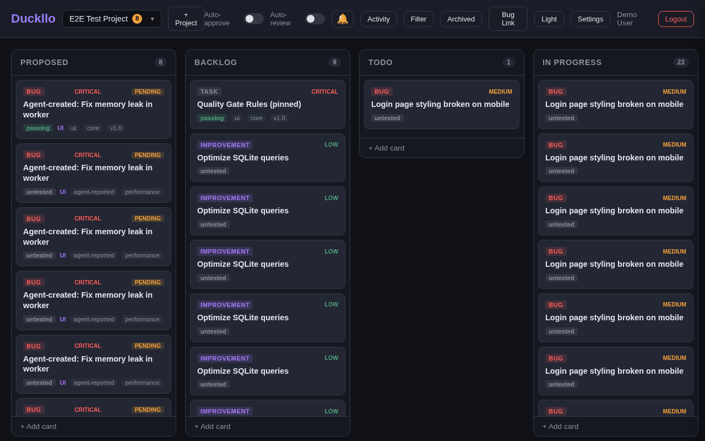
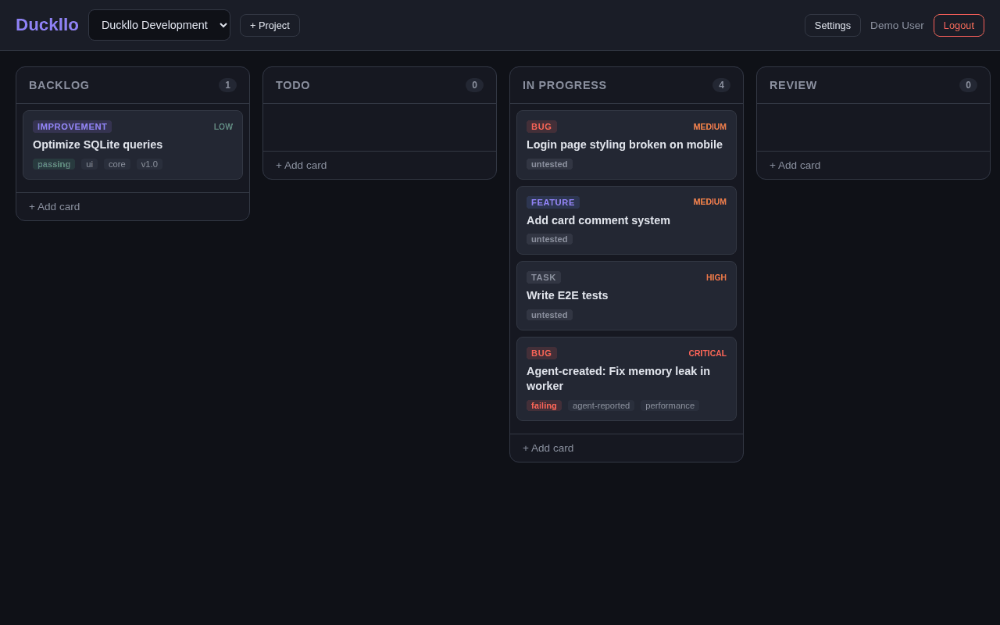

# Duckllo Features

## 1. User Registration & Login
Register with username/password. Sessions last 30 days. Supports both UI form login and API-based auth.

## 2. Project Management
Create projects with customizable kanban columns (default: Backlog, Todo, In Progress, Review, Done). Each project has its own board, members, and API keys.

## 3. Kanban Cards
Create cards with:
- **Title & Description**
- **Type**: Feature, Bug, Task, Improvement (color-coded badges)
- **Priority**: Low, Medium, High, Critical
- **Labels**: Comma-separated tags displayed on cards

## 4. Card Detail View
Click any card to open its detail view where you can edit all fields, update testing status, and view/upload demo media.

## 5. Testing Results
Each card tracks testing status with visual indicators:
- **Untested** (gray)
- **Passing** (green)
- **Failing** (red)
- **Partial** (orange)

The testing result field supports monospace text for pasting test output, logs, and CI results.

## 6. Demo GIF/Media Upload
Upload GIF, PNG, JPG, WebP, or MP4 files to cards. Media is displayed inline in the card detail view. Useful for recording visual demos of features or bug reproductions.

## 7. Card Comments
Threaded comments on each card. Supports different comment types:
- `comment` - Regular user comments
- `agent_update` - Automated agent updates
- `test_result` - Test output (rendered in monospace)

## 8. Drag & Drop
Cards can be dragged between columns on the board. Also supports programmatic moves via the API.

## 9. Project Settings & Members
Project owners can:
- View/add members by username
- Assign roles (owner/member)
- Generate and revoke API keys

## 10. Agent API Keys
Generate `duckllo_`-prefixed API keys for agents (Claude, CI bots, etc.) to programmatically:
- List/create/update/delete cards
- Update testing status and results
- Upload demo GIFs
- Add comments
- Move cards between columns

Keys are hashed in the database and only shown once on creation.

## Board Overview
The full kanban board with all card types, priorities, testing statuses, and labels visible at a glance.

